<div align="center">

<!-- Banner: Dual-Layer Animated Floyd-Steinberg Dither & Logo Morphing Banner -->
<picture>
  <source media="(prefers-color-scheme: dark)" srcset="./dark.svg">
  <source media="(prefers-color-scheme: light)" srcset="./light.svg">
  
</picture>

<br/><br/>

<!-- Social Badges (for-the-badge style, &nbsp;&nbsp; spacing) -->
<a href="https://www.linkedin.com/in/rachit-kushwaha-8b8714297/" target="_blank">
  
</a>
&nbsp;&nbsp;
<a href="https://instagram.com/_.rachitkushwaha" target="_blank">
  
</a>
&nbsp;&nbsp;
<a href="mailto:rachitkushwaha890@gmail.com" target="_blank">
  
</a>
&nbsp;&nbsp;
<a href="https://my-portfolio-gamma-five-86.vercel.app/" target="_blank">
  
</a>

</div>

<br/>

---

## 👤 About Me

<table>
<tr>
<td width="55%" valign="top">

### 🎯 Who I Am

```yaml
name: Rachit Kushwaha
username: rachit-890
role: Java Backend Developer
location: Ghaziabad, India 🇮🇳
education: B.Tech Computer Science, KIET Group of Institutions (AKTU), Class of 2027
status: Building Scalable Backend Systems with Java & Spring Boot

core_stack:
  - ☕ Java & Spring Boot Microservices
  - 📨 Event-Driven Architecture (Apache Kafka)
  - ⚡ High-Performance Caching (Redis)
  - 🔐 Security (Spring Security, JWT, OAuth2)
  - 🗄️ Relational & NoSQL Databases (PostgreSQL, MySQL, MongoDB)
  - 🐳 Containerization & CI/CD (Docker, GitHub Actions, Maven)

philosophy: "Build systems that scale, write code that lasts."
```

</td>
<td width="45%" valign="top">

### 🚀 Current Focus

- 🏗️ **Architecting** high-throughput Java & Spring Boot microservices
- 📨 **Implementing** event-driven streaming pipelines with Apache Kafka
- ⚡ **Optimizing** data access with Redis caching & PostgreSQL
- 🔐 **Securing** RESTful APIs with JWT & OAuth2
- 📦 **Containerizing** environments with Docker & GitHub Actions
- 🧠 **Practicing** Data Structures & System Design daily

<br/>

### 💡 Quick Facts

- 🎓 KIET Group of Institutions (AKTU), Class of 2027
- 🏅 Advanced Java Certified — GeeksforGeeks
- 📂 20+ backend repositories on GitHub
- 💻 150+ DSA problems solved on LeetCode & Codeforces

</td>
</tr>
</table>

<br/>

---

## 📊 GitHub Analytics

<!-- Streak Card (100% Width) -->
<div align="center">
  <a href="https://github.com/rachit-890">
    
  </a>
</div>

<br/>

<!-- Side-by-Side Stats & Top Languages Cards (49% Width Each) -->
<div align="center">
  <a href="https://github.com/rachit-890">
    
  </a>
  &nbsp;
  <a href="https://github.com/rachit-890">
    
  </a>
</div>

<br/>

---

## 🐍 Contribution Graph Snake

<div align="center">
  <picture>
    <source media="(prefers-color-scheme: dark)" srcset="https://raw.githubusercontent.com/rachit-890/rachit-890/output/github-contribution-grid-snake-dark.svg">
    <source media="(prefers-color-scheme: light)" srcset="https://raw.githubusercontent.com/rachit-890/rachit-890/output/github-contribution-grid-snake.svg">
    
  </picture>
</div>

<br/>

---

## 🛠️ Featured Projects

### 🤖 AICodeReviewBot — Autonomous AI Code Review Agent
> `Jul 2026 – Present`

```
An autonomous code auditor that intercepts GitHub Pull Request webhooks, runs AI security checks using Google Gemini, and posts inline suggestions.
```

| Feature | Details |
|---|---|
| 🧠 AI Analysis | Powered by Google Gemini 2.5 Flash API via LangChain4j with schema-enforced JSON parsing |
| 🔐 Verification | Zero-trust authentication via SHA-256 hashed API keys and HMAC-SHA256 webhook signatures |
| ⚡ Caching | Integrates Redis caching of review payloads based on MD5 hashes of PR URLs and commit SHAs |
| ⏱️ Rate Limiting | Implements Redis token-bucket rate limiting with a thread-safe JVM memory failover fallback |

**Tech Stack:**


---

### 🛒 DreamShops — E-commerce Microservices Platform
> `Jun 2025 – Present`

```
Architected a production-grade e-commerce platform built on microservices principles.
```

| Feature | Details |
|---|---|
| 🏗️ Architecture | API Gateway, service discovery, load balancing |
| 🔐 Auth | JWT/OAuth2 via Keycloak with RBAC |
| ⚡ Performance | 60% boost with Redis caching + Kafka event processing |
| 📄 Docs | RESTful APIs documented with Swagger/OpenAPI |

**Tech Stack:**


<br/>

---

## 💻 Tech Stack & ToolChain

<div align="center">
  <p>
    
  </p>
</div>

<br/>

<div align="center">
  <sub>⭐ Star some repos if you find them useful — it helps a lot!</sub>
</div>
